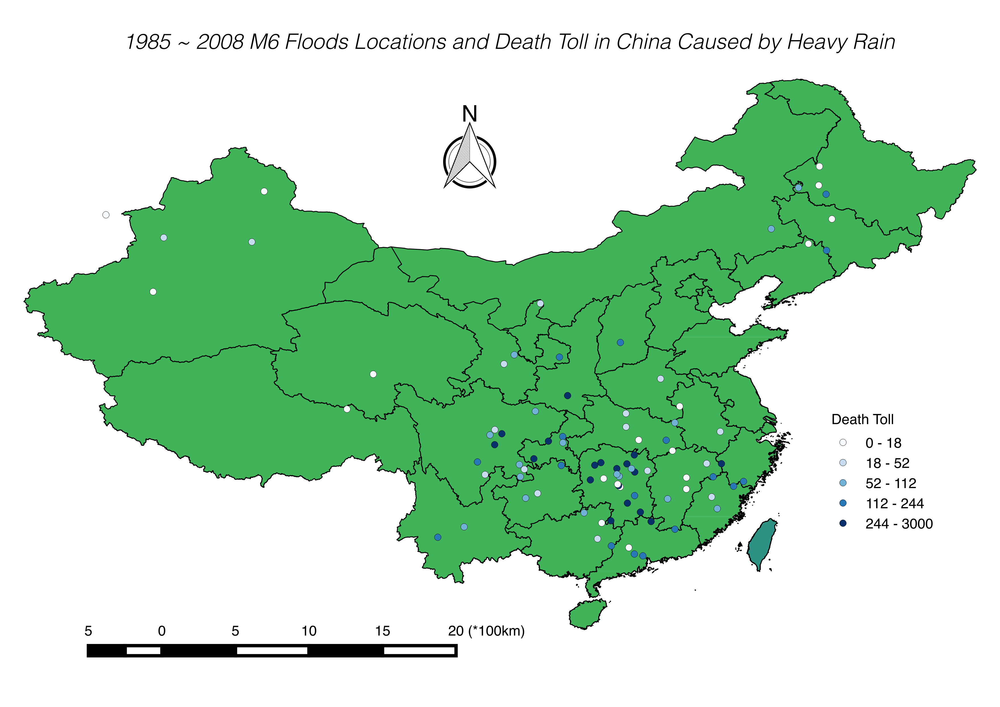

##Project Description
In this project, we will analysis the global floods records from 1985 to 2008. Specifically, we will invesitgate the floods patterns over time, floods distribution across continent, causes of floods and relation between floods and air pressure. 


##Floods Patterns Over Time

```{r, echo=FALSE, message=FALSE, warning=FALSE}
library(ncdf4)
library(xlsx)
library(reshape)
library(dplyr)
library(ggplot2)
library(gridExtra)
################ _cc
fname <- 'new_phi_data_cc.nc'
ncin <- nc_open(fname)

time <- ncvar_get(ncin, 'T')
tunits <- ncatt_get(ncin, 'T', 'units')

lon <- ncvar_get(ncin,'X')
lat <- ncvar_get(ncin, 'Y')

pre <- ncvar_get(ncin, 'P')

phi.array <- ncvar_get(ncin, 'phi')

year = 1948
year_total= 0
total_35  = 0 
total_70 = 0
days = 0
year_ave = NULL
ave_35_ls = NULL
ave_70_ls = NULL
for (i in 0:(length(time)-1)){
  this_date = as.Date(i,origin = '1948-01-01')
  this_year = as.numeric(format(this_date,'%Y'))
  day_ave = mean(phi.array[,,i+1])
  ave_35 = mean(phi.array[,15:25,i+1])
  ave_70 = mean(phi.array[,1:14, i+1])
  if (this_year==year){
      year_total = year_total + day_ave
      total_35 = total_35 + ave_35
      total_70 = total_70 +ave_70
      days = days + 1
  }
  else{
    year_mean = year_total/days
    mean_35 = total_35/days
    mean_70 = total_70/days
    year_ave = append(year_ave, year_mean)
    ave_35_ls = append(ave_35_ls, mean_35)
    ave_70_ls = append(ave_70_ls,mean_70)
    year = year + 1
    year_total = day_ave
    total_35 = ave_35
    total_70 = ave_70
    days = 1
  }
  
}
year_mean = year_total/days
year_ave = c(year_ave, year_mean)
mean_35 = total_35/days
mean_70 = total_70/days
ave_35_ls = append(ave_35_ls, mean_35)
ave_70_ls = append(ave_70_ls, mean_70)

phi_year = data.frame((1948 + 0:(length(year_ave)-2)),year_ave[-length(year_ave)]) 
colnames(phi_year) = c('year', 'ave_phi')

phi_year_35 = data.frame((1948 + 0:(length(ave_35_ls)-2)),ave_35_ls[-length(ave_35_ls)]) 
colnames(phi_year_35) = c('year', 'ave_phi_35')

phi_year_70 = data.frame((1948 + 0:(length(year_ave)-2)),ave_70_ls[-length(ave_70_ls)]) 
colnames(phi_year_70) = c('year', 'ave_phi_70')

```

```{r, echo=FALSE, message=FALSE, warning=FALSE}
flood <- read.csv("GlobalFloodsRecord.csv", header = T)
nameuse <- c("Country", "Detailed.Locations..click.on.active.links.to.access.inundation.extents.", "Began", "Ended", "Duration.in.Days", "Dead", "Displaced", "Main.cause", "Severity..", "Affected.sq.km", "Magnitude..M...", "Centroid.X", "Centroid.Y", "M.6", "M.4")
floodinfo <- flood[ , nameuse]
colnames(floodinfo) <- c("Country", "Detailed.Locations", "Began", "Ended", "Duration", "Dead", "Displaced", "Cause", "Severity", "Affected.sq.km", "Magnitude", "Longitude", "Latitude", "Extreme", "Large")

floodinfo$Longitude <- as.numeric(as.character(floodinfo$Longitude))
floodinfo$Latitude <- as.numeric(as.character(floodinfo$Latitude))
floodinfo <- na.omit(floodinfo)

floodinfo$Began <- as.Date(as.character(floodinfo$Began), "%d-%B-%y")
floodinfo$Ended <- as.Date(as.character(floodinfo$Ended), "%d-%B-%y")

floodinfo_N35_N70 <- filter(floodinfo, Latitude <= 70 & Latitude >= 35)
floodinfo_N10_N35 <- filter(floodinfo, Latitude < 35 & Latitude >= 10)
```


First, to have a basic idea about world floods records, we show historical floods in a world map. 

```{r,results='asis',tidy=FALSE, echo=FALSE, message=FALSE, warning=FALSE}
library(googleVis)
op <- options(gvis.plot.tag='chart')

floodinfo$Latlong <- paste(floodinfo$Latitude, floodinfo$Longitude, sep = ":")
FloodMap <- gvisMap(floodinfo, "Latlong", "Began",
                     options=list(showTip=TRUE, 
                                  showLine=TRUE, 
                                  enableScrollWheel=TRUE,
                                  mapType='terrain', 
                                  useMapTypeControl=TRUE))
plot(FloodMap)
```


Also, a [dynamic map](https://yusenwang.shinyapps.io/Dynamic_Flood_Map/) is available. To see that interactive map, click the words "dynamic map".

##Floods by Continent

```{r libraries, echo=F, message=F, warning=F}
library(lubridate)
library(animation)
library(reshape2)
library(RColorBrewer)
library(gridExtra)
library(ggmap)
library(dplyr)
```

```{r dataClean, echo=F, message=F, warning=F}
################
## DATA CLEAN ##
################

## Read floods.
floods <- read.csv("GlobalFloodsRecord.csv", stringsAsFactors = F)

## Clean and generate new columns.
floods$lon <- as.numeric(floods$Centroid.X)
floods$lat <- as.numeric(floods$Centroid.Y)
floods$dead <- as.numeric(floods$Dead)
floods$displaced <- as.numeric(floods$Displaced)
floods$severity <- as.numeric(floods$Severity..)
floods$damage <- as.numeric(floods$Damage..USD.)
floods$country <- as.factor(floods$Main.cause)
floods$other <- as.factor(floods$Country)
floods$cause <- as.factor(floods$Other)
floods$magnitude <- as.numeric(floods$Magnitude..M...)
floods$began <- as.Date(floods$Began,"%d-%b-%y")
floods$ended <- as.Date(floods$Ended,"%d-%b-%y")
floods$start <- year(floods$began)
floods$end <- year(floods$ended)


## Remove useless columns and add grouping dates.
floods2 <- tbl_df(floods[,-(1:30)])
floods2 <- floods2[!is.na(floods2$began),]
breaks = round(seq(1985, 2016, 7.75))
floods2$breaks <- cut(floods2$start, breaks = breaks, labels = breaks[-1], right = F)
levels(floods2$breaks) <- c("1985-1993","1994-2000","2001-2008","2009-2016")
```

As a next step in the analysis, we look at the distribution of floods across the different continents throughout time. The goal is to identify possible patterns, and address questions such as:

- Have floods concentrated on particular continents during specific periods?
- For any given continent, have there been more disastrous times in terms of floods and displacement?
- Within continents, which regions are more susceptible to disasters caused by floods?

To do this, we will divide the data into 4 roughly equally sized time periods: `r levels(floods2$breaks)`. We will then produce plots for each continent during these periods, highlighting the flood events that occurred with their size indicating their total impact as measured on a scale that depends on displacement. A contour plot will also help us identify where clusters of these events occurred.  

```{r byContinent1, echo=F, message=F, warning=F, fig.width= 13, fig.height = 8, cache = T}
#############################
## FLOODS BY CONTINENT PT1 ##
#############################

flood.cols <- brewer.pal(n = 5, name = "OrRd")

## NORTH AMERICA
america <- get_map("America", zoom =4 , maptype = "roadmap")

america.map <- ggmap(america,  extent="panel") %+%
  floods2 +
  #aes(x = lon, y = lat, z = log(displaced)) +
  aes(x = lon, y = lat) +
  #stat_summary_2d(fun = "sum", bins = 60, alpha = 0.75) + 
  stat_density2d(aes(fill = ..level.., alpha = ..level..), geom = "polygon") +
  scale_fill_gradientn(name = "Floods", colours = flood.cols, space = "Lab") +
  scale_alpha(range = c(0.1, 0.5)) +
  labs(x = "Longitude", y = "Latitude", title = "North America") +
  theme(legend.position = "none", plot.title = element_text(size = rel(1.5))) +
  coord_map()

america.facet <- america.map +
  geom_point(aes(x = lon, y = lat, size = displaced), fill="red", shape=21, alpha=0.6) +
  facet_wrap(~ breaks)

## SOUTH AMERICA
south.america <- get_map("South America", zoom =4 , maptype = "roadmap")

south.america.map <- ggmap(south.america,  extent="panel") %+%
  floods2 +
  #aes(x = lon, y = lat, z = log(displaced)) +
  aes(x = lon, y = lat) +
  #stat_summary_2d(fun = "sum", bins = 60, alpha = 0.75) + 
  stat_density2d(aes(fill = ..level.., alpha = ..level..), geom = "polygon") +
  scale_fill_gradientn(name = "Floods", colours = flood.cols, space = "Lab") +
  scale_alpha(range = c(0.1, 0.5)) +
  labs(x = "Longitude", y = "Latitude", title = "South America") +
  theme(legend.position = "none", plot.title = element_text(size = rel(1.5))) +
  coord_map()

south.america.facet <- south.america.map +
  geom_point(aes(x = lon, y = lat, size = displaced), fill="red", shape=21, alpha=0.6) +
  facet_wrap(~ breaks)

## PLOT THESE 2
grid.arrange(america.facet, south.america.facet, ncol = 2)
```

Interestingly on North America the majority of the events are concentrated on the east coast, while South America shows the opposite pattern. Some regions that are constantly affected by floods are the U.S. Mid-West, the Yucatan Peninsula, and the region that encompasses Colombia and Ecuador. Cuba, being an island, is also highly susceptible to these kind of natural disasters, with a large-displacement event occurring on during the 2000's.

```{r byContinent2, echo=F, message=F, warning=F, fig.width= 13, fig.height = 8, cache = T}
#############################
## FLOODS BY CONTINENT PT2 ##
#############################

## EUROPE
europe <- get_map("Europe", zoom =4 , maptype = "roadmap")

europe.map <- ggmap(europe,  extent="panel") %+%
  floods2 +
  #aes(x = lon, y = lat, z = log(displaced)) +
  aes(x = lon, y = lat) +
  #stat_summary_2d(fun = "sum", bins = 60, alpha = 0.75) + 
  stat_density2d(aes(fill = ..level.., alpha = ..level..), geom = "polygon") +
  scale_fill_gradientn(name = "Floods", colours = flood.cols, space = "Lab") +
  scale_alpha(range = c(0.1, 0.5)) +
  labs(x = "Longitude", y = "Latitude", title = "Europe") +
  theme(legend.position = "none", plot.title = element_text(size = rel(1.5))) +
  coord_map()

europe.facet <- europe.map +
  geom_point(aes(x = lon, y = lat, size = displaced), fill="red", shape=21, alpha=0.6) +
  facet_wrap(~ breaks)

## ASIA
asia <- get_map("Asia", zoom =4 , maptype = "roadmap")

asia.map <- ggmap(asia,  extent="panel") %+%
  floods2 +
  #aes(x = lon, y = lat, z = log(displaced)) +
  aes(x = lon, y = lat) +
  #stat_summary_2d(fun = "sum", bins = 60, alpha = 0.75) + 
  stat_density2d(aes(fill = ..level.., alpha = ..level..), geom = "polygon") +
  scale_fill_gradientn(name = "Floods", colours = flood.cols, space = "Lab") +
  scale_alpha(range = c(0.1, 0.5)) +
  labs(x = "Longitude", y = "Latitude", title = "Asia") +
  theme(legend.position = "none", plot.title = element_text(size = rel(1.5))) +
  coord_map()

asia.facet <- asia.map +
  geom_point(aes(x = lon, y = lat, size = displaced), fill="red", shape=21, alpha=0.6) +
  facet_wrap(~ breaks)

## PLOT THESE 2
grid.arrange(europe.facet, asia.facet, ncol = 2)
```

Turning to Europe, we notice that starting on the 1900's the Balkan Peninsula became constantly impacted by flood disasters. The United Kingdom, due to its geographical position, is also exposed to a greater number of floods, although it had a relatively stable period throughout the second half of the 90's. We notice that displacement is generally low on this continent.

The story on Asia is considerably different to what we have seen so far: floods are a frequent phenomena on the east coast of India, with China and the South-East region being constantly affected as well. Displacement tends to be generally higher, which could be explained both by the frequency of the events and by the civil planning required to handle them, although more investigation is required on the latest.

```{r byContinent3, echo=F, message=F, warning=F, fig.width= 13, fig.height = 8, cache = T}
#############################
## FLOODS BY CONTINENT PT3 ##
#############################

## AFRICA
africa <- get_map("Africa", zoom =4 , maptype = "roadmap")

africa.map <- ggmap(africa,  extent="panel") %+%
  floods2 +
  #aes(x = lon, y = lat, z = log(displaced)) +
  aes(x = lon, y = lat) +
  #stat_summary_2d(fun = "sum", bins = 60, alpha = 0.75) + 
  stat_density2d(aes(fill = ..level.., alpha = ..level..), geom = "polygon") +
  scale_fill_gradientn(name = "Floods", colours = flood.cols, space = "Lab") +
  scale_alpha(range = c(0.1, 0.5)) +
  labs(x = "Longitude", y = "Latitude", title = "Africa") +
  theme(legend.position = "none", plot.title = element_text(size = rel(1.5))) +
  coord_map()

africa.facet <- africa.map +
  geom_point(aes(x = lon, y = lat, size = displaced), fill="red", shape=21, alpha=0.6) +
  facet_wrap(~ breaks)

## AUSTRALIA
australia <- get_map("Australia", zoom =4 , maptype = "roadmap")

australia.map <- ggmap(australia,  extent="panel") %+%
  floods2 +
  #aes(x = lon, y = lat, z = log(displaced)) +
  aes(x = lon, y = lat) +
  #stat_summary_2d(fun = "sum", bins = 60, alpha = 0.75) + 
  stat_density2d(aes(fill = ..level.., alpha = ..level..), geom = "polygon") +
  scale_fill_gradientn(name = "Floods", colours = flood.cols, space = "Lab") +
  scale_alpha(range = c(0.1, 0.5)) +
  labs(x = "Longitude", y = "Latitude", title = "Australia") +
  theme(legend.position = "none", plot.title = element_text(size = rel(1.5))) +
  coord_map()

australia.facet <- australia.map +
  geom_point(aes(x = lon, y = lat, size = displaced), fill="red", shape=21, alpha=0.6) +
  facet_wrap(~ breaks)

## PLOT THESE 2
grid.arrange(africa.facet, australia.facet, ncol = 2)
```

Moving now to Africa, we see again the pattern of more floods occurring on the western coast. Displacement does not seems to be so prevalent, although this could be due to more inefficient bookkeeping? We also identify Kenya and Tanzania as 2 regions that are particularly prone to these disasters.

Finally looking at Australia we notice that, although it is a continent with a large surface of contact with water, floods are not so prevalent. The clusters we observe correspond to the neighboring Indonesia and Malaysia, which are particularly succeptible.

##Distribution by main cause / death : top floods causes , different from cause of deaths


```{r, echo=FALSE, fig.width = 15, fig.height = 5}
#setwd("/Users/vernon/Dropbox/courses/Columbia/STAT_W4701_EDA_and_visualization/hw/hw2/EDAV_Project_2/Yuhao_analysis_on_M6_floods/Proj2_final")
file <- read.csv("GlobalFloodsRecord.csv", header = TRUE)
file$Dead <- as.numeric(as.character(file$Dead))
file <- na.omit(file)
mod_file <- data.frame(file$Dead, tolower(file$Main.cause))


heavy_rain = nrow(mod_file[grep("hea", mod_file$tolower.file.Main.cause),])
tropical_cyclone = nrow(mod_file[grep("tropical cycl", mod_file$tolower.file.Main.cause),]) - nrow(mod_file[grep("extra", mod_file$tolower.file.Main.cause),])
extra_tropical_cyclone = nrow(mod_file[grep("extra", mod_file$tolower.file.Main.cause),])
monsoonal_rain = nrow(mod_file[grep("mon", mod_file$tolower.file.Main.cause),])
snowmelt = nrow(mod_file[grep("snow", mod_file$tolower.file.Main.cause),])
ice_jam_break_up = nrow(mod_file[grep("ice", mod_file$tolower.file.Main.cause),])
dam_levy_break_release = nrow(mod_file[grep("dam", mod_file$tolower.file.Main.cause),])
torrential_rain = nrow(mod_file[grep("torr", mod_file$tolower.file.Main.cause),])
tidal_storm_surge = nrow(mod_file[grep("surge", mod_file$tolower.file.Main.cause),])
avalanche_related = nrow(mod_file[grep("aval", mod_file$tolower.file.Main.cause),])

par(mfrow=c(1,1))

height1 = c(heavy_rain, tropical_cyclone,extra_tropical_cyclone,monsoonal_rain,snowmelt,ice_jam_break_up,dam_levy_break_release,torrential_rain, tidal_storm_surge, avalanche_related)
name1 = c("heavy rain", "tropical cyclone","extra tropical cyclone","monsoonal rain","snowmelt","ice jam break up","dam levy break release","torrential rain", "tidal storm surge", "avalanche related")
color1 = c("coral4","coral3","coral","coral3","coral2","coral","coral","coral3","coral","coral")
barplot(height1, names.arg = name1, cex.names=0.8,cex.axis = 0.6, main = "Distribution of main causes", xlab = "main causes", ylab = "number of registers", col = color1, cex.lab = 2, cex.main = 3)

```

Next, we did some analysis of main causes and death. From the distribution of main causes, we found "heavy rain" is the primary main cause of floods, over 2500 registers of floods are caused by heavy rain, which is much higher than any other causes. 


```{r, echo=FALSE,  fig.width = 15, fig.height = 5}
heavy_rain_death = sum(mod_file[grep("hea", mod_file$tolower.file.Main.cause),]$file.Dead)
tropical_death = sum(mod_file[grep("tropical cycl", mod_file$tolower.file.Main.cause),]$file.Dead) - sum(mod_file[grep("extra", mod_file$tolower.file.Main.cause),]$file.Dead)
extra_tropical_death = sum(mod_file[grep("extra", mod_file$tolower.file.Main.cause),]$file.Dead)
monsoonal_death = sum(mod_file[grep("mon", mod_file$tolower.file.Main.cause),]$file.Dead)
snowmelt_death = sum(mod_file[grep("snow", mod_file$tolower.file.Main.cause),]$file.Dead)
ice_jam_death = sum(mod_file[grep("ice", mod_file$tolower.file.Main.cause),]$file.Dead)
dam_levy_death = sum(mod_file[grep("dam", mod_file$tolower.file.Main.cause),]$file.Dead)
torrential_death = sum(mod_file[grep("torr", mod_file$tolower.file.Main.cause),]$file.Dead)
tidal_death = sum(mod_file[grep("surge", mod_file$tolower.file.Main.cause),]$file.Dead)
avalanche_death = sum(mod_file[grep("aval", mod_file$tolower.file.Main.cause),]$file.Dead)


height2 = c(heavy_rain_death, tropical_death,extra_tropical_death,monsoonal_death,snowmelt_death,ice_jam_death,dam_levy_death,torrential_death, tidal_death, avalanche_death)
name2 = c("heavy rain", "tropical cyclone","extra tropical cyclone","monsoonal rain","snowmelt","ice jam break up","dam levy break release","torrential rain", "tidal storm surge", "avalanche related")
color2 = c("gray30","gray10","gray80","gray40","gray80","gray80","gray80","gray50","gray20","gray80")
barplot(height2, names.arg = name2, cex.names=0.8,cex.axis = 0.6, main = "Distribution of death", xlab = "main causes", ylab = "number of deaths", col = color2, cex.lab = 2, cex.main = 3)

```

However, although "tropical cyclone" and "tidal storm surge" have only around 500 registers, respectively, they were the main causes of death. After ordering the top 10 registers which have the most number of death, 5 of the top 10 registers are caused by these two natural disasters. Compared to the death caused by "heavy rain", less than 100000 people died in floods caused by "heavy rain", although it's the primary main cause of floods.


## Displacement

```{r include = FALSE, warning = FALSE}
library(rworldmap)
library(RColorBrewer)
```
We also wanted to look at how floods affect displacement globally. We are using subset data of countries and respective number of people displaced. In order to get a broad understanding of displacement over time, the graphs have been generated for every 10 years i.e. the number of people displaced has been mapped for the years 1985, 1995, 2005 amd 2015.

```{r include = FALSE}
f85 <- read.csv("country_flood_severity_displaced_year85.csv")

sPDF85 <- joinCountryData2Map(f85, joinCode = "NAME", nameJoinColumn = "Country")
        colourPalette <- brewer.pal(4,'GnBu')
```

```{r echo = FALSE}
mapParams <- mapCountryData(sPDF85, nameColumnToPlot="Displaced",           colourPalette=colourPalette, catMethod=c(0,0.5e+06,1e+06,1.5e+06,2e+06),addLegend=FALSE, mapTitle = "Displaced by floods in 1985")

do.call( addMapLegend, c( mapParams, legendLabels="all", legendWidth=0.5))
```

```{r include = FALSE}
f95 <- read.csv("country_flood_severity_displaced_year95.csv")

sPDF95 <- joinCountryData2Map(f95, joinCode = "NAME", nameJoinColumn = "Country")
        colourPalette <- brewer.pal(4,'GnBu')
```

```{r echo = FALSE}
mapParams <- mapCountryData(sPDF95, nameColumnToPlot="Displaced",           colourPalette=colourPalette, catMethod=c(0,0.5e+06,1e+06,1.5e+06,2e+06),addLegend=FALSE, mapTitle = "Displaced by floods in 1995")

do.call( addMapLegend, c( mapParams, legendLabels="all", legendWidth=0.5))
```

```{r include = FALSE}
f05 <- read.csv("country_flood_severity_displaced_year05.csv")

sPDF05 <- joinCountryData2Map(f05, joinCode = "NAME", nameJoinColumn = "Country")
        colourPalette <- brewer.pal(4,'GnBu')
```

```{r echo = FALSE}
mapParams <- mapCountryData(sPDF05, nameColumnToPlot="Displaced",           colourPalette=colourPalette, catMethod=c(0,0.5e+06,1e+06,1.5e+06,2e+06),addLegend=FALSE, mapTitle = "Displaced by floods in 2005")

do.call( addMapLegend, c( mapParams, legendLabels="all", legendWidth=0.5))
```

```{r include = FALSE}
f15 <- read.csv("country_flood_severity_displaced_year15.csv")

sPDF15 <- joinCountryData2Map(f15, joinCode = "NAME", nameJoinColumn = "Country")
        colourPalette <- brewer.pal(4,'GnBu')
```

```{r echo = FALSE}
mapParams <- mapCountryData(sPDF15, nameColumnToPlot="Displaced",           colourPalette=colourPalette, catMethod=c(0,0.5e+06,1e+06,1.5e+06,2e+06),addLegend=FALSE, mapTitle = "Displaced by floods in 2015")

do.call( addMapLegend, c( mapParams, legendLabels="all", legendWidth=0.5))
```
From the plots above, we find:
    + Several regions in African continent have minimal displacement. This may be sttributed to no floods in those regions. This is supported by the finding that the African countries where people got displaced match the countries that had floods. However, it can't be ruled out that lack of record keeping may be a possible reason.  
    + Asia has significant displacement. One of the factors is potentially the highest population density in Asia.
    
##M6 Floods Caused by Heavy Rain

```{r, echo=FALSE, message=FALSE, warning=FALSE}
#library(ncdf4)
library(gdata)
library(MASS)
library(png)
```

From previous analysis, we found that heavy rain is the reason which caused the largest number of floods. Here, we researched on the floods caused by heavy rain that had a level of M6. We count the occurence of M6 level floods at each countries from 1985 to 2008. The countries with the largest 20 occurence are displayed in the following dotchart. From the plot, we can see that in the time period 1985 to 2008 China and USA have much more M6 floods than other countries. We then analysised the M6 floods in China. 

```{r, echo=FALSE, message=FALSE}
#setwd("/Users/vernon/Dropbox/courses/Columbia/STAT_W4701_EDA_and_visualization/hw/hw2/EDAV_Project_2/Yuhao_analysis_on_M6_floods/Proj2_final")

records = read.csv("record_new_yuhao.csv",na.strings = "NA")

records_clean = records[,c(-2,-3,-6,-5,-7)]
records_clean = records_clean[c(-820,-1997,-2001,-2002,-1010,-2008,-4043),]
countries = records_clean$Country
countries = as.character(countries)   #change factor to character which will make the index system work...lol

for (i in 1:length(countries)){
  countries[i] = gsub("\xca","",countries[i]) #remove the <ca> in country field
  #countries[i] = gsub("Columbia","Colombia",countries[i])
}
for (i in 1:length(countries)){
  #countries[i] = gsub("\xca","",countries[i]) #remove the <ca> in country field
  countries[i] = gsub("Columbia","Colombia",countries[i])
}

records_clean$Country= countries #update the column, the type of the column is still factor, however now the index system works, like records_clean$Country[1]

causes= as.character(records_clean$Main.cause) #this is very important, to convert it so to use it properly

#unique(causes)

dead_record = as.numeric(as.character(records_clean$Dead))

max_dead = max(dead_record, na.rm=TRUE)

max_dead_record = records[1716,]

#analyze the heavy rain problem
heavy_rain = records_clean[which(records_clean$Main.cause == "Heavy rain"),]

M6 = heavy_rain[which(heavy_rain$M.6 == 1),]

#heavy_con contains the times of occurence of M6 flood caused by heavy rain in one country
heavy_con = as.data.frame(table(M6$Country)) #way to count the occurrence of each element in a vector


n <- length(heavy_con$Freq)
l20 = sort(heavy_con$Freq,partial=n-20)[n-20] #the 20th largest occurrence

heavy_con_6 = heavy_con[which(heavy_con$Freq > 6),] 


dotchart(heavy_con_6$Freq,heavy_con_6$Var1,col=ifelse(heavy_con_6$Freq==87, "red", "black"),xlab = "plot (1) number of M6 floods 1985~2008")


#get the china M6 floods records
M6_China = M6[which(M6$Country == "China"),]
M6_China_lon = M6_China$Centroid.X
M6_China_lat = M6_China$Centroid.Y
M6_China_reg = M6_China$Detailed.Locations..click.on.active.links.to.access.inundation.extents.
M6_China_start = M6_China$Began
end = M6_China$Ended
dead = M6_China$Dead
M6_China_loc = data.frame(M6_China_lon,M6_China_lat,dead,M6_China_reg, M6_China_start, end)

write.csv(M6_China_loc,file = "M6_China.csv",row.names = FALSE)

#img<-readPNG("")

#get size
#h<-dim(img)[1]
#w<-dim(img)[2]

#open new file for output
#png("out.png", width=w, height=h)
#path to the image in the bracket
```

 

In this plot, we plotted all the floods locations with a level at least M6 happened in China from 1985 to 2015 with the death toll. As we can the most deadly floods happened in Hunan province. 

##How Preassure Data Related to Floods

As final part of our analysis, we will look at how preassure levels relate to floods and their intensity, if this relationship exists. First, it would be interesting to see how preassure levels vary over time, and investigate if the levels exhibit some patterns across the different coordinates. The plots below show this information, for selected time periods.


We see that although the pressure levels don't change throughout these different time periods, they do exhibit some seasonality and higher concentration on the latitudes closer to the equator. The plots below provide more information on how these patterns evolve. 

```{r, echo=FALSE, message=FALSE, warning=FALSE}
############################################# World
annual_num_extreme_flood_yr <- floodinfo %>%
        mutate(Began_yr=as.numeric(format(as.POSIXct(floodinfo$Began,format="%Y-%m-%d %I:%M:%S %p"),"%Y"))) %>% 
        group_by(Began_yr, Extreme) %>% 
        summarise(n()) %>% filter(Extreme == 1)
        
annual_num_large_flood_yr <- floodinfo %>%
        mutate(Began_yr=as.numeric(format(as.POSIXct(floodinfo$Began,format="%Y-%m-%d %I:%M:%S %p"),"%Y"))) %>% 
        group_by(Began_yr, Large) %>% 
        summarise(n()) %>% filter(Large == 1)
annual_num_large_flood_yr <- annual_num_large_flood_yr[-1, ]

bind = data.frame(annual_num_large_flood_yr$Began_yr, annual_num_large_flood_yr$`n()`)
colnames(bind) = c('year','large')
phi_year_sub = subset(phi_year,year>=1985)
ggplot(phi_year_sub, aes(x = year, y = ave_phi))+ geom_point(size = 3, alpha = 0.5, color = '#66b3ff')+geom_smooth(se = F,size = 0.75, color = '#3399ff', linetype = 'dashed') +theme_bw()+ ggtitle('Average Phi by Years') + ylab('Average Phi') 

p1a = ggplot(data = bind, aes(x = year, y = large))+geom_line(size = 3, alpha = 0.5, color = '#66b3ff')+theme_bw()+ ggtitle('M4_average') + ylab('# of floods') 

bind2 = data.frame(annual_num_extreme_flood_yr$Began_yr, annual_num_extreme_flood_yr$`n()`)
colnames(bind2) = c('year','extreme')
p1b = ggplot(data = bind2, aes(x = year, y = extreme))+geom_line(size = 3, alpha = 0.5, color = '#ff6600')+theme_bw()+ ggtitle('M6_average') + ylab('# of floods')

grid.arrange(p1a, p1b, ncol = 1)
```

Aligned X-axis, ave_phi is increasing， dashed smooth line, M4 and M6 are increasing with some variances, but after 2010, a tenancy of decreasing.

```{r, echo=F}
################################################### N35-N70
annual_num_extreme_flood_70 <- floodinfo_N35_N70 %>%
        mutate(Began_yr=as.numeric(format(as.POSIXct(floodinfo_N35_N70$Began,format="%Y-%m-%d %I:%M:%S %p"),"%Y"))) %>% 
        group_by(Began_yr, Extreme) %>% 
        summarise(n()) %>% filter(Extreme == 1)
        
annual_num_large_flood_70 <- floodinfo_N35_N70 %>%
        mutate(Began_yr=as.numeric(format(as.POSIXct(floodinfo_N35_N70$Began,format="%Y-%m-%d %I:%M:%S %p"),"%Y"))) %>% 
        group_by(Began_yr, Large) %>% 
        summarise(n()) %>% filter(Large == 1)
annual_num_large_flood_yr <- annual_num_large_flood_70[-1, ]

binda = data.frame(annual_num_large_flood_70$Began_yr, annual_num_large_flood_70$`n()`)
colnames(binda) = c('year','large')
phi_year_70_sub = subset(phi_year_70, year>=1985)

ggplot(phi_year_70_sub, aes(x = year, y = ave_phi_70))+ geom_point(size = 3, alpha = 0.5, color = '#66b3ff')+geom_smooth(se = F,size = 0.75, color = '#3399ff', linetype = 'dashed') +theme_bw()+ ggtitle('Average Phi by Years_N35-N70') + ylab('Average Phi') 

p2a = ggplot(data = binda, aes(x = year, y = large))+geom_line(size = 3, alpha = 0.5, color = '#66b3ff')+theme_bw()+ ggtitle('M4_N34-N70') + ylab('# of floods') 

bind2a = data.frame(annual_num_extreme_flood_70$Began_yr, annual_num_extreme_flood_70$`n()`)
colnames(bind2a) = c('year','extreme')
p2b = ggplot(data = bind2a, aes(x = year, y = extreme))+geom_line(size = 3, alpha = 0.5, color = '#ff6600')+theme_bw()+ ggtitle('M6_N34-N70') + ylab('# of floods')
grid.arrange(p2a, p2b,ncol = 1)

```

Same tendency as total, but with less magnitude.


```{r, echo=F}
################################################## N10-N35
annual_num_extreme_flood_35 <- floodinfo_N10_N35 %>%
        mutate(Began_yr=as.numeric(format(as.POSIXct(floodinfo_N10_N35$Began,format="%Y-%m-%d %I:%M:%S %p"),"%Y"))) %>% 
        group_by(Began_yr, Extreme) %>% 
        summarise(n()) %>% filter(Extreme == 1)
        
annual_num_large_flood_35 <- floodinfo_N10_N35 %>%
        mutate(Began_yr=as.numeric(format(as.POSIXct(floodinfo_N10_N35$Began,format="%Y-%m-%d %I:%M:%S %p"),"%Y"))) %>% 
        group_by(Began_yr, Large) %>% 
        summarise(n()) %>% filter(Large == 1)
annual_num_large_flood_35 <- annual_num_large_flood_35[-1, ]

bindb = data.frame(annual_num_large_flood_35$Began_yr, annual_num_large_flood_35$`n()`)
colnames(bindb) = c('year','large')
phi_year_35_sub = subset(phi_year_35, year>=1985)
ggplot(phi_year_35_sub, aes(x = year, y = ave_phi_35))+ geom_point(size = 3, alpha = 0.5, color = '#66b3ff')+geom_smooth(se = F,size = 0.75, color = '#3399ff', linetype = 'dashed') +theme_bw()+ ggtitle('Average Phi by Years_N10-N35') + ylab('Average Phi') 

p3a = ggplot(data = bindb, aes(x = year, y = large))+geom_line(size = 3, alpha = 0.5, color = '#66b3ff')+theme_bw()+ ggtitle('M4_N10-N35') + ylab('# of floods') 

bind2b = data.frame(annual_num_extreme_flood_35$Began_yr, annual_num_extreme_flood_35$`n()`)
colnames(bind2b) = c('year','extreme')
p3b = ggplot(data = bind2b, aes(x = year, y = extreme))+geom_line(size = 3, alpha = 0.5, color = '#ff6600')+theme_bw()+ ggtitle('M6_N10-N35') + ylab('# of floods')
grid.arrange(p3a, p3b, ncol=1)

```

Same tendency as total, with higher magnitude.

Based on above plots, we can see that total annual floods have an apparent periodicity. Large floods and extreme floods share a similar trend. What should be concerned is that we are in a dangerous time period now, because in 2015, large floods seem to touch the bottom of its periodicity. Maybe there would be more floods in 2016.

```{r,echo = F}
########################################## compare all
phi_all = data.frame(phi_year$year,phi_year$ave_phi,phi_year_35$ave_phi_35, phi_year_70$ave_phi_70)
colnames(phi_all) = c('year', 'ave_phi','ave_phi_35', 'ave_phi_70')

ggplot() + geom_point(data = phi_all, aes(x = year, y = ave_phi, color = '10N-70N'), size = 3, alpha = 0.5) + geom_point(data = phi_all, aes(x= year, y = ave_phi_35, color = "10N-35N"),size = 3, alpha = 0.5)+ geom_point(data = phi_all, aes(x = year, y = ave_phi_70, color = "35N-70N"),size = 3, alpha = 0.5) + theme_bw() +scale_color_manual(name = "Latitude", values = c('#ff8080', "#66b3ff",  '#CCFF33') )+ggtitle('Average Phi by years') +ylab('Average Phi')

#M4
ggplot() + geom_point(data = bind, aes(x = year, y = large, color = 'Total'), size = 3, alpha = 0.8) + geom_point(data = binda, aes(x = year, y = large, color = 'N35-N70'), size = 3, alpha = 0.8) +geom_point(data = bindb, aes(x = year, y = large, color = 'N10-N35'), size = 3, alpha = 0.8)+theme_bw() +scale_color_manual(name = "Latitude", values = c('#ff8080', "#66b3ff",  '#CCFF33') )+ggtitle('M4 Floods by years') +ylab('# of Floods')

# M6
ggplot() + geom_point(data = bind2, aes(x = year, y = extreme, color = 'Total'), size = 3) + geom_point(data = bind2a, aes(x = year, y = extreme, color = 'N35-N70'), size = 3) +geom_point(data = bind2b, aes(x = year, y = extreme, color = 'N10-N35'), size = 3)+theme_bw() +scale_color_manual(name = "Latitude", values = c('#ff8080', "#66b3ff",  '#CCFF33') )+ggtitle('M6 Floods by years') +ylab('# of Floods')

```

10N-35N has higher average phi, and more floods.  
35n-70N has lower average phi, and less floods.

```{r,echo=F}

###################################################   
comp_data = data.frame(phi_year_sub$ave_phi,bind$large)
colnames(comp_data) = c('ave_phi','large')
#M4
ggplot(comp_data,aes(x =ave_phi, y= large ))+geom_point(size = 2, alpha = 0.9, color = '#ff99ff') + geom_smooth(method = 'lm', se = F,size = 1, color = '#ff66ff', linetype = 'dashed') +theme_bw()+ ggtitle('Relationship between Average Phi and Large Floods') + ylab('# of Large Floods')+xlab('Average Phi')

#M6
comp_data2 = data.frame(phi_year_sub$ave_phi, bind2$extreme)
colnames(comp_data2) = c('ave_phi','extreme')
ggplot(comp_data2,aes(x =ave_phi, y= extreme ))+geom_point(size = 2, alpha = 0.9, color = '#cc99cc') + geom_smooth(method = 'lm',se = F,size = 1, color = '#9966cc', linetype = 'dashed') +theme_bw()+ ggtitle('Relationship between Average Phi and Extreme Floods') + ylab('# of Extreme Floods')+xlab('Average Phi')
        
###########################################################################
```

The dashed line is a fitted line from linear regression. We can see apparent positive relationships between average phi and floods whether or not floods are extreme or large.

For extreme floods, it has less variance, while more variance on large floods.