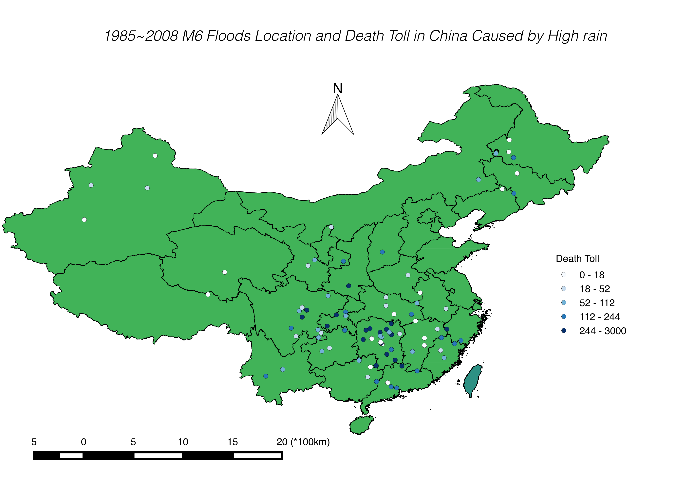

```{r, echo=FALSE, message=FALSE, warning=FALSE}
library(ncdf4)
library(gdata)
library(MASS)
library(png)
```

M6 floods analysis

In this analysis, we researched on the floods that had a level of M6. We count the occurence of M6 level floods at each countries from 1985 to 2008. The countries with the largest 20 occurence are displayed in the following dotchart. From the plot, we can see that in the time period 1985 to 2008 China and USA have much more M6 floods than other countries. We then analysised the M6 floods in China. 
```{r, echo=FALSE, message=FALSE}
setwd("/Users/vernon/Dropbox/courses/Columbia/STAT_W4701_EDA_and_visualization/hw/hw2")

records = read.csv("record_new.csv",na.strings = "NA")

records_clean = records[,c(-2,-3,-6,-5,-7)]
records_clean = records_clean[c(-820,-1997,-2001,-2002,-1010,-2008,-4043),]
countries = records_clean$Country
countries = as.character(countries)   #change factor to character which will make the index system work...lol

for (i in 1:length(countries)){
  countries[i] = gsub("\xca","",countries[i]) #remove the <ca> in country field
  #countries[i] = gsub("Columbia","Colombia",countries[i])
}
for (i in 1:length(countries)){
  #countries[i] = gsub("\xca","",countries[i]) #remove the <ca> in country field
  countries[i] = gsub("Columbia","Colombia",countries[i])
}

records_clean$Country= countries #update the column, the type of the column is still factor, however now the index system works, like records_clean$Country[1]

causes= as.character(records_clean$Main.cause) #this is very important, to convert it so to use it properly

#unique(causes)

dead_record = as.numeric(as.character(records_clean$Dead))

max_dead = max(dead_record, na.rm=TRUE)

max_dead_record = records[1716,]

#analyze the heavy rain problem
heavy_rain = records_clean[which(records_clean$Main.cause == "Heavy rain"),]

M6 = heavy_rain[which(heavy_rain$M.6 == 1),]

#heavy_con contains the times of occurence of M6 flood caused by heavy rain in one country
heavy_con = as.data.frame(table(M6$Country)) #way to count the occurrence of each element in a vector


n <- length(heavy_con$Freq)
l20 = sort(heavy_con$Freq,partial=n-20)[n-20] #the 20th largest occurrence

heavy_con_6 = heavy_con[which(heavy_con$Freq > 6),] 


dotchart(heavy_con_6$Freq,heavy_con_6$Var1,col=ifelse(heavy_con_6$Freq==87, "red", "black"),xlab = "plot (1) number of M6 floods 1985~2008")


#get the china M6 floods records
M6_China = M6[which(M6$Country == "China"),]
M6_China_lon = M6_China$Centroid.X
M6_China_lat = M6_China$Centroid.Y
M6_China_reg = M6_China$Detailed.Locations..click.on.active.links.to.access.inundation.extents.
M6_China_start = M6_China$Began
end = M6_China$Ended
dead = M6_China$Dead
M6_China_loc = data.frame(M6_China_lon,M6_China_lat,dead,M6_China_reg, M6_China_start, end)

write.csv(M6_China_loc,file = "M6_China.csv",row.names = FALSE)

#img<-readPNG("")

#get size
#h<-dim(img)[1]
#w<-dim(img)[2]

#open new file for output
#png("out.png", width=w, height=h)
#path to the image in the bracket
```

 

In this plot, we plotted all the floods locations with a level at least M6 happened in China from 1985 to 2015 with the death toll. As we can the most deadly floods happened in Hunan province. 
